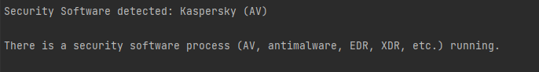

# Security Software Detector
This program detects if any security software (AV, EDR, XDR, firewall, etc.) is running on the system. The program searches the list of running processes and compares their names with a predefined list of known security software processes.

# Requirements
A C++17 or later compatible compiler.
Windows as the operating system.

# Compilation
Open a terminal or command prompt.
Navigate to the directory where the main.cpp file is located.
Compile the program using CLion, also a C++17 or later compatible compiler. For example, to compile with g++, execute the following command:
```
g++ -std=c++17 -o av_detect main.cpp
```
This will create an executable file named av_detect.exe in the same directory.

# Detected Apps
- Agnitum Outpost Firewall - Firewall
- Avast (additional process) - AV
- Avast - AV
- Avira - AV
- AxCrypt - Encryption
- Bitdefender (additional processes) - AV
- Bitdefender Total Security - AV
- Check Point Daemon - Security
- Check Point Firewall - Firewall
- Cisco AnyConnect Secure Mobility Client - VPN
- Cisco Umbrella Roaming Security - Security
- CrowdStrike Falcon (additional processes) - EDR
- CrowdStrike Falcon Insight XDR - XDR
- Cybereason EDR - EDR
- Cytomic Orion - Security
- DriveSentry - Security
- ESET NOD32 AV - AV
- Elastic Winlogbeat - Security
- FireEye Endpoint Agent - Security
- FireEye HX - Security
- FortiEDR - EDR
- Host Intrusion Prevention System - HIPS
- Kaspersky (additional processes) - AV
- Kaspersky - AV
- Kaspersky Secure Connection - VPN
- Kerio Personal Firewall - Firewall
- Malwarebytes (additional processes) - AV
- Malwarebytes - AV
- McAfee (additional processes) - AV
- McAfee DLP Sensor - DLP
- McAfee Endpoint Encryption - Encryption
- McAfee Endpoint Security - AV
- McAfee Endpoint Security Firewall - Firewall
- McAfee Host Intrusion Prevention - HIPS
- McAfee VirusScan - AV
- Microsoft Defender ATP (Advanced Threat Protection) - Security
- Microsoft Security Essentials - AV
- Microsoft Sysmon - Security
- Norton Antivirus - AV
- OpenVPN - VPN
- Palo Alto Networks Cortex XDR - XDR
- Palo Alto Networks GlobalProtect - VPN
- Panda Security - AV
- Sandboxie - Security
- SentinelOne (additional processes) - EDR
- SentinelOne Singularity XDR - XDR
- Sophos (additional processes) - AV
- Sophos Endpoint Security - AV
- Symantec DLP Agent - DLP
- Symantec Endpoint Protection - AV
- Tanium EDR - EDR
- Trend Micro (additional processes) - AV
- Trend Micro OfficeScan - AV
- TrueCrypt - Encryption
- VMware Carbon Black EDR - EDR
- Webroot Anywhere - AV
- Windows Defender - AV
- WireGuard - VPN

# Usage
Execute the compiled program in a terminal or command prompt. The program will show if any security software is detected running on the system.

```
./av_detect.exe
```
The program will display "Security software is running." if any security software is detected, and "No security software detected." otherwise.



# Alternative usage using only PowerShell, without using the executable

You can use a PowerShell command to directly interact with the CSV hosted on GitHub, without the need to download the project or compile it.

The original command uses the `[PSCustomObject]` notation to create a custom object directly and add it to `$FoundProcesses`. 
However, this notation caused errors in restrictive environments, so an alternative approach with `Select-Object` was used.

```
$Url="https://raw.githubusercontent.com/nand0san/av_detect/main/processes.csv"; $ProcessesCSV = Invoke-WebRequest -Uri $Url -UseBasicParsing | ConvertFrom-Csv; $RunningProcesses = Get-Process; $FoundProcesses = @(); foreach ($process in $ProcessesCSV) { $runningProcess = $RunningProcesses | Where-Object { $_.ProcessName -like $process.Process.Replace('.exe','') }; if ($runningProcess) { $ProcessInfo = "" | Select-Object Process, Name, Type; $ProcessInfo.Process = $runningProcess.ProcessName; $ProcessInfo.Name = $process.Name; $ProcessInfo.Type = $process.Type; $FoundProcesses += $ProcessInfo; } }; $FoundProcesses | Format-Table
```
Output example:
```
$Url="https://raw.githubusercontent.com/nand0san/av_detect/main/processes.csv"; $ProcessesCSV = Invoke-WebRequest -Uri 
$Url -UseBasicParsing | ConvertFrom-Csv; $RunningProcesses = Get-Process; $FoundProcesses = @(); foreach ($process in 
$ProcessesCSV) { $runningProcess = $RunningProcesses | Where-Object { $_.ProcessName -like $process.Process
.Replace('.exe','') }; if ($runningProcess) { $ProcessInfo = "" | Select-Object Process, Name, Type; 
$ProcessInfo.Process = $runningProcess.ProcessName; $ProcessInfo.Name = $process.Name; $ProcessInfo.Type = 
$process.Type; $FoundProcesses += $ProcessInfo; } }; $FoundProcesses | Format-Table

Process                Name                        Type
-------                ----                        ----
avp                    Kaspersky                   AV

```

# How it Works
The program uses the CreateToolhelp32Snapshot function from the Windows API to obtain a list of all running processes on the system. It then compares the name of each process with a predefined list of known security software processes. If it finds a match, the program considers that security software is running on the system.

The list of security software processes is located in the main.cpp file in the securitySoftwareProcesses dictionary. You can add, remove, or modify entries in this dictionary as needed.
